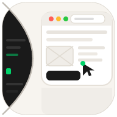

# AgentClick

<p align="center">
  
</p>

<p align="center">
  Human review UI for AI agents.
</p>

<p align="center">
  Move from terminal-only interaction to a shared browser workflow where the agent can propose, the user can inspect and edit, and only then the action continues.
</p>

<p align="center">
  <a href="https://www.npmjs.com/package/agentclick"></a>
  <a href="./LICENSE"></a>
  <a href="https://www.npmjs.com/package/agentclick"></a>
</p>

---

## What AgentClick Is For

Most agents still interact like this:

- user types in terminal
- agent prints text
- agent acts

That is too narrow for high-risk or high-context work.

AgentClick extends the interaction into a browser UI so the agent can hand off a structured review surface for things like:

- emails and inbox triage
- shell commands and risky actions
- plans and trajectories
- forms and selections
- memory review

The goal is simple: keep the speed of terminal agents, but add a real review layer before the agent commits to irreversible work.

---

## Why It Helps

- **Edit before execution**: the user can change the draft, command, or payload instead of only approve/reject.
- **Shared visual context**: the agent and user move from raw terminal text to a purpose-built UI.
- **Preference learning**: feedback from review can be persisted so the agent improves over time.
- **Framework-agnostic**: anything that can `POST` JSON and poll an HTTP endpoint can use it.

---

## Quick Start

```bash
npm install -g @harvenstar/agentclick
agentclick
```

For remote access from another device:

```bash
agentclick --remote
```

`--remote` automatically downloads and starts a [Cloudflare Quick Tunnel](https://developers.cloudflare.com/cloudflare-one/connections/connect-networks/do-more-with-tunnels/trycloudflare/). It prints a public HTTPS URL you can open on your phone or another machine.

---

## Use It With An Agent

If your agent can work with local repos and local skills, keep the instructions short.

Example:

1. Ask the agent to download or clone AgentClick.
2. Ask the agent to load the skill from this repo.
3. Ask the agent to use AgentClick for review-heavy tasks.

Prompt:

```text
Download agentlayer-io/AgentClick, load its SKILL.md, start it locally, and use it whenever you need a browser review UI instead of only terminal output.
```

If the agent supports sub-skills, the root [`SKILL.md`](./SKILL.md) routes to the right one automatically.

---

## Skill Layout

The root skill is [`SKILL.md`](./SKILL.md). It routes to the right sub-skill.

| Skill | Path | Purpose |
|---|---|---|
| Router | `SKILL.md` | Entry point that routes the agent to the right review workflow. |
| Action Approval | `skills/clickui-approve/` | Approve or reject risky actions before execution. |
| Code Review | `skills/clickui-code/` | Review shell commands, diffs, and code-related actions in UI. |
| Email Review | `skills/clickui-email/` | Review inbox items, drafts, replies, and live email sessions. |
| Plan Review | `skills/clickui-plan/` | Inspect and revise proposed plans before the agent runs them. |
| Trajectory Review | `skills/clickui-trajectory/` | Review multi-step runs, mistakes, and resume points. |
| Memory Review | `skills/clickui-memory/` | Review memory files and memory-management changes. |

For direct agent usage, telling the agent to load the root skill is usually enough.

---

## Development

```bash
git clone https://github.com/agentlayer-io/AgentClick.git
cd AgentClick
npm install
npm run dev
```

Development mode:

- server: `http://localhost:38173`
- web: `http://localhost:5173`

Production-style single-port serving:

```bash
npm run build
npm start
```

---

## License

MIT
